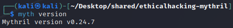
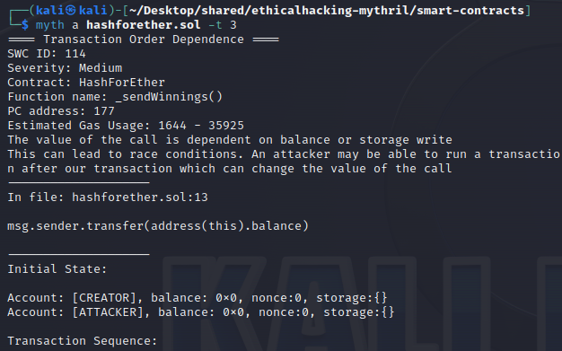
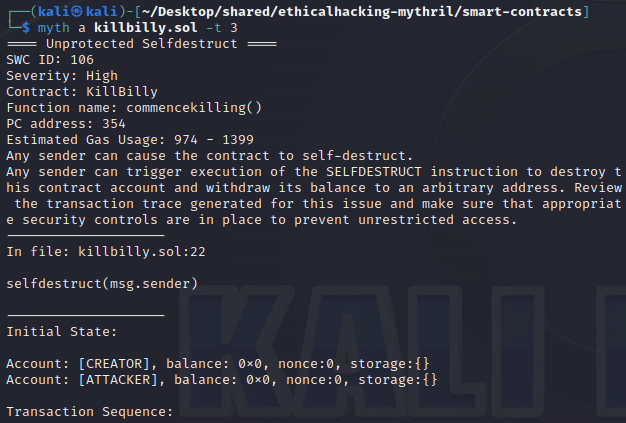
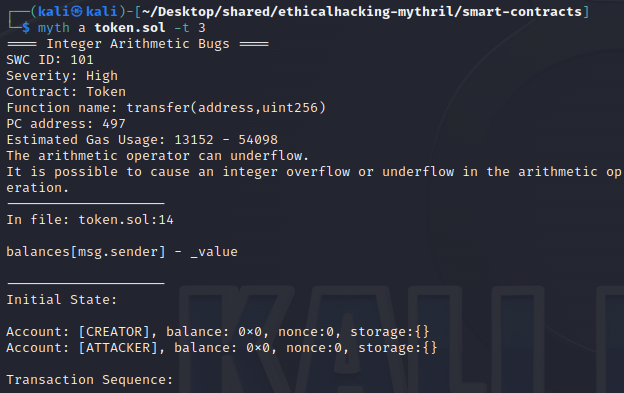

# ethicalhacking-mythril

## What is ethical hacking and what is it used for?

Ethical hacking involves a hacker agreeing with an organisation or individual who authorizes the hacker to levy cyber-attacks on a system or network to expose potential vulnerabilities. An ethical hacker is also sometimes referred to as a white hat hacker. Many depend on ethical hackers to identify weaknesses in their networks, endpoints, devices, or applications. The hacker informs their client as to when they will be attacking the system, as well as the scope of the attack.

## Smart contract ethical hacking

We should find out threats and vulnerabilities in those systems (and mitigate them).
For example, *Mythril* is a security analysis tool for EVM (Ethereum Virtual Machine) bytecode. It detects security vulnerabilities in smart contracts built for Ethereum, Hedera, Quorum, Vechain, Roostock, Tron and other EVM-compatible blockchains. It uses symbolic execution, SMT solving and taint analysis to detect a variety of security vulnerabilities [Mythril 24].

## Installation on Linux

Open a new terminal and type:
```
apt-get update -y
```
### Install libssl-dev, python3-dev, and python3-pip
```
apt-get install -y libssl-dev python3-dev python3-pip
```
### Install solc
```
apt-get install -y software-properties-common
```
```
add-apt-repository -y ppa:ethereum/Ethereum
```
```
apt-get install -y solc
```
### Install mythril
```
pip3 install mythril
```
### Check mythril can run
```
myth version
```


## Execution

```
myth analyze <solidity-file>
```
Or:
```
myth analyze -a <contract-address>
```
You can find a smart contract address list here [Etherscan 24].  
As you will see, for Matic Token (MATIC) its smart contract address is as follows: `0x7D1AfA7B718fb893dB30A3aBc0Cfc608AaCfeBB0`  
Specify the maximum number of transactions to explore with `-t <number>`. You can also set a timeout with `--execution-timeout <seconds>`.  

Here is an example of running Mythril on the file `hashforether.sol` which is in the smart-contracts directory for 3 transactions:
```
myth a hashforether.sol -t 3
```


The Mythril analysis of our smart contract HashForEther has identified two main vulnerabilities: **Transaction Order Dependence** and **Unprotected Ether Withdrawal**. Here is an explanation of each:  

Transaction Order Dependence  
**SWC ID**: 114  
**Severity**: Medium  
**Location**: In the _sendWinnings() function of the HashForEther contract, specifically at line 13 in the hashforether.sol file.  
**Description**: This vulnerability refers to the fact that the value of the call depends on the balance or a storage write. This can lead to race conditions where an attacker might be able to execute a transaction after yours, changing the value of the call. In your case, the use of msg.sender.transfer(address(this).balance) means that the transferred value depends on the contract's balance at the time of the call, which could be manipulated by preceding transactions.  

Unprotected Ether Withdrawal  
**SWC ID**: 105  
**Severity**: High  
**Location**: In the same function and line as the previous vulnerability.  
**Description**: This vulnerability indicates that any sender can withdraw Ether from the contract account. Arbitrary senders other than the contract creator can profitably extract Ether from the contract account. This is because the function allows any msg.sender to transfer the entire balance of the contract to their own address without adequate restrictions to verify who is making the call.  

Recommendations:  
**For Transaction Order Dependence**: Consider implementing mechanisms that ensure state consistency before performing critical operations, such as checking the balance or limiting operations that can change the relevant state between the check and the execution.  
**For Unprotected Ether Withdrawal**: Ensure that only authorized actors (e.g., the contract owner or specific participants) can withdraw Ether. This can be achieved by verifying the identity of the sender (msg.sender) against a list of authorized addresses or by using modifiers that restrict access to critical functions.

It is crucial to review and address these vulnerabilities before deploying the contract on the main network to prevent potential attacks and loss of funds.

Here is an example of running Mythril on the file `killbilly.sol` which is in the smart-contracts directory for 3 transactions:
```
myth a killbilly.sol -t 3
```


Here is an example of running Mythril on the file `token.sol` which is in the smart-contracts directory for 3 transactions:
```
myth a token.sol -t 3
```


## Building the documentation

Mythril's documentation is contained in the docs folder and is published to read the docs [Mythril 24]. It is based on Sphinx and can be built using the Makefile contained in the subdirectory:
```
docs/make html
```
This will create a build output directory containing the HTML output. Alternatively, pdf documentation can be built with:
```
build/make latexpdf
```
The available output format options can be seen with:
```
build/make help
```

## Conclusions

*Mythril* stands as an indispensable tool in the toolkit of any smart contract developer, offering a critical layer of security and verification before deployment on the main network. Its ability to pinpoint both common and complex vulnerabilities enables developers to rectify potentially critical errors, significantly contributing to the development of safer and more reliable decentralized applications.
By conducting a thorough analysis of the smart contracts' bytecode, Mythril can identify a broad spectrum of vulnerabilities, including those that might be overlooked during a manual code review. As an open-source tool, Mythril benefits from the ongoing contributions of the community, ensuring regular updates and the addition of new features to address emerging threats.
For newcomers or those with less experience, Mythril may present an initial learning curve due to its complexity and the necessity to understand the technical details of the identified vulnerabilities.

## References

[Etherscan 24] Etherscan. Token Tracker (ERC-20). April 2024.  
Available at: https://etherscan.io/tokens

[Examples 24] Mythril. Solidity examples. April 2024.  
Available at: https://github.com/Consensys/mythril/tree/develop/solidity_examples

[Mythril 24] Mythril. Security analysis tool for Ethereum smart contracts. PyPI. April 2024.  
Available at: https://pypi.org/project/mythril/

## Disclaimer

This software is for educational purposes only. It should not be used for illegal activity. The author is not responsible for its use. Do not be a dick.
